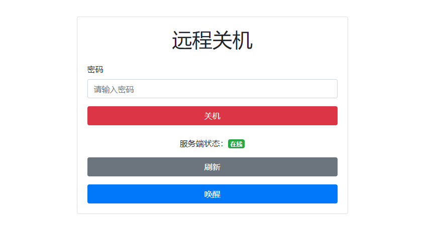

# PyPower

[中文](README.md) | [English](https://github.com/eMUQI/PyPower/blob/main/_i18n/en/README.md)

这个项目可以通过一个Flask web应用实现远程关机的功能。

## 项目文件说明

*请不要可信网络环境以外部署！*

- `server.py`：服务端（Windows）代码文件，用于接收客户端发送过来的关机请求，并执行关机命令。
- `client.py`：客户端（树莓派）代码文件，提供一个Web页面，让用户输入密码后，向服务端发送关机请求。还可以通过wakeonlan唤醒服务端。
- `templates/index.html`：客户端Web页面模板文件。

## 代码文件修改

1. 如果需要修改服务端的关机命令，可以在`server.py`文件中修改`subprocess.call()`函数的参数。
2. 如果需要修改客户端页面的样式或功能，可以修改`templates/index.html`文件。
3. 在客户端电脑上运行`client.py`文件前，请注意将`WINDOWS_IP`和`WINDOWS_PORT`修改为服务端电脑的IP地址和端口号。修改`WINDOWS_MAC_ADDRESS`为服务端电脑的mac地址。

## 运行方式

1. 在服务端电脑上运行`server.py`文件，启动Flask服务端（默认使用5000端口）。
2. 在客户端电脑上运行`client.py`文件，启动Flask客户端（默认使用8000端口）。
3. 在浏览器中输入客户端电脑的IP地址和端口号，进入关机页面，输入正确的密码后，点击"关机"按钮即可实现远程关机。
4. 本项目仅用于学习和测试，不要将其用于非法用途。

## 致谢

感谢 ChatGPT 对这个项目的贡献和帮助。